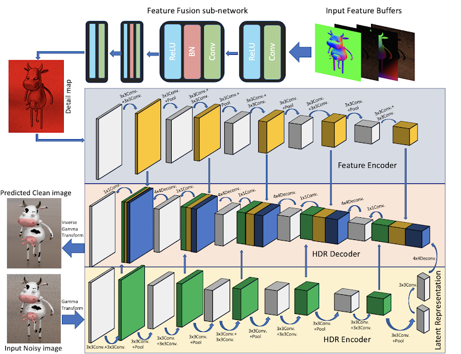

# DEMC

---

## CVM 2019 [[Paper]](https://arxiv.org/pdf/1905.03908.pdf) [[Project Page]](https://sites.google.com/view/dutdemc) 

A deep Dual-Encoder network, used for denoising Monte Carlo renderings. The feature buffers and noisy image are generated from renderer. The feature buffers are firstly fused by a feature fusion sub-network to get a detail map, and then the detail map and noisy image are encoded by the feature encoder and HDR encoder respectively. Finally, the latent representation is decoded to reconstruct a clean image with skip connection from the Dual-Encoder.

## Getting Started

---

### Installation

xxx

### Testing

## TODO

- [ ] Add model defination
- [ ] Add test code
- [ ] Add pretrained model

